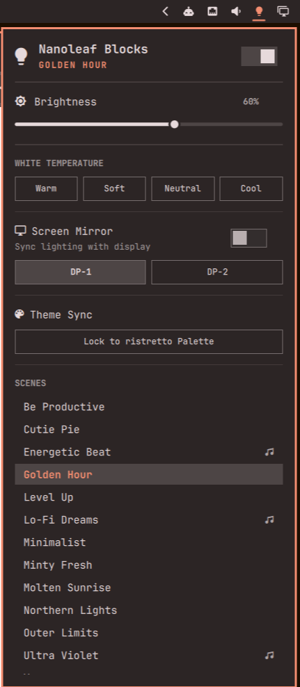

# nanoleaf-ctl

Control Nanoleaf light panels from your Linux desktop. `nanoleaf-ctl` is a standalone command-line tool, and
an optional [Quickshell](https://quickshell.org) bar widget for the Omarchy shell gives you the same controls
in a panel:



- power, brightness, white temperature and scenes
- screen mirroring on any detected display
- palette sync: lock the lights to a color palette (for example your desktop theme), or preview a new one
  briefly and then restore
- restore the last state at login

> [!NOTE]
> The widget handles first-run pairing from the panel (hides mirroring and theme sync when they
> aren't available) and ships with its own copy of the command-line tool, so there is nothing else to install.
> Install it from the Omarchy plugin page (link coming soon).

## Install as an Omarchy plugin

```sh
omarchy plugin add https://github.com/anat0lius/nanoleaf-ctl --enable
```

Open the widget in the bar and follow the pairing steps. Update with `omarchy plugin update`.

## Uninstall

If you turned on "Auto on/off" in the widget, turn it off first (it installs a systemd user unit that
points at the plugin). Then:

```sh
omarchy plugin remove io.github.anat0lius.nanoleaf
```

To also forget the pairing and saved state, delete `~/.config/nanoleaf` and `~/.local/state/nanoleaf`.

## Requirements

Python 3.10+, standard library only: nothing to `pip install` to run it. A few optional system tools
enable specific features:

| Tool | Needed for |
| --- | --- |
| `avahi-daemon` | Finding the device when pairing (not needed if you give its IP) |
| `grim` and Hyprland | Screen mirroring only; everything else works without them |

It uses Nanoleaf's local OpenAPI, so it should work with the panel products that expose it (Light Panels,
Canvas, Shapes, Elements, Lines, Blocks). So far it has been tested only with Nanoleaf Blocks, on Omarchy.

## Quick start

```sh
git clone <this repo> && cd nanoleaf-ctl
uv tool install --editable .      # provides `nanoleaf-ctl`
nanoleaf-ctl pair
nanoleaf-ctl status
```

`pair` finds the device over mDNS (needs `avahi-daemon`; or pass `--ip 192.168.x.x`), then asks you to
**hold the controller's power button for 5–7 seconds** until the LED flashes. The auth token is saved to
`~/.config/nanoleaf/config.json`.

Without installing: `PYTHONPATH=src python3 -m nanoleaf_ctl <command>`.

## Usage

```sh
nanoleaf-ctl status                 # power, brightness, current scene
nanoleaf-ctl on | off | toggle
nanoleaf-ctl rename "Desk lights"   # display name (empty string = the device's own name)
nanoleaf-ctl brightness 60
nanoleaf-ctl scenes                 # list scenes (♪ = reacts to music)
nanoleaf-ctl scene "Northern Lights"
nanoleaf-ctl ct 2700                # white temperature in Kelvin
nanoleaf-ctl mirror start           # mirror the focused display
nanoleaf-ctl mirror start --display DP-2
nanoleaf-ctl mirror displays        # detected displays
nanoleaf-ctl mirror stop
nanoleaf-ctl theme-sync --name sunset --colors "#f38d70" "#85dacc" "#fd6883"
nanoleaf-ctl theme-sync --off       # unlock and restore the previous scene
nanoleaf-ctl theme-change --name dawn --colors "#f9cc6c" "#a8a9eb"
nanoleaf-ctl session-start --once   # restore last state (once per login)
nanoleaf-ctl session-end            # turn off
nanoleaf-ctl session-service enable # on at login, off at logout (systemd user unit); or: disable, status
```

Every command that takes over the lights (scene, ct, mirror, theme sync) cancels the others, so only one
mode is active at a time.

### Palette sync

`theme-sync` locks the lights to a flowing animation of the colors you pass. `theme-change` is meant to be
called by whatever changes your palette (a theme switcher, a script): if the lock is on it re-syncs to the
new colors, otherwise it previews them for 2 seconds and restores whatever the lights were doing.

## Configuration

The plugin changes nothing on your system until you ask: `pair` writes the config below, and the systemd
user unit is written only when you turn on "Auto on/off" (or run `session-service enable`).

`~/.config/nanoleaf/config.json` (under `$XDG_CONFIG_HOME`) is written by `pair`. Runtime state lives in
`$XDG_STATE_HOME/nanoleaf/`. Optional config keys:

| Key | Meaning |
| --- | --- |
| `ip` | Device address. If you set it before pairing (`{"ip": "192.168.1.50"}`), `pair` uses it instead of discovery |
| `friendly_name` | Name shown instead of the device's own name (set it with `nanoleaf-ctl rename`) |
| `mirror_display` | Preferred display for mirroring (default: the focused display) |

## Status JSON

`nanoleaf-ctl status --json` is the interface other front-ends (such as `Panel.qml`) build on.
`tests/test_status_contract.py` guards its shape. When no device is paired it prints
`{"configured": false}`.

| Field | Type | Meaning |
| --- | --- | --- |
| `configured` | bool | A device is paired |
| `name`, `rawName`, `model`, `serialNo`, `firmware` | string | Device info (`name` honors `friendly_name`) |
| `on` | bool | Power |
| `brightness`, `hue`, `sat`, `ct` | number | Current state (brightness/sat in %, hue in degrees, `ct` in Kelvin) |
| `colorMode` | string | `effect`, `ct` or `hs` |
| `currentEffect` | string | Active scene (shown as `Theme: …` while palette sync is locked) |
| `effectsList` | string[] | All scenes |
| `musicScenes` | string[] | Scenes that react to music |
| `mirror` | object | `{active, display, pid, fps, trans_time}` |
| `displays` | string[] | Detected display names |
| `capabilities` | object | `{mirror}`: true when `grim` and a display are available |
| `themeSync` | object | `{synced, theme, mode, palette}` |
| `panelLayout` | object | Raw panel layout from the device |

## Troubleshooting

- **`pair` finds nothing:** make sure `avahi-daemon` is running, or give the address: pass `--ip`, or create
  `~/.config/nanoleaf/config.json` containing `{"ip": "192.168.1.50"}` and pair again.
- **Pairing never completes:** hold the power button until the LED flashes, then release.
- **`status` fails after the router or device IP changed:** run `nanoleaf-ctl pair --ip <new ip>`.
- **Mirroring does nothing:** check that `grim` works and `nanoleaf-ctl mirror displays` lists your display.
- **Lights aren't restored as expected after a restart:** check what was saved and what ran at login.
  `~/.local/state/nanoleaf/power-intent.json` holds the last mode (`theme`, `scene`, `ct` or `mirror`).
  `journalctl --user -b -u 'nanoleaf*'` shows which state was restored at login.

## Repository layout

- `src/nanoleaf_ctl/` — the Python package (`cli.py` is the entry point)
- `manifest.json`, `Panel.qml` — Quickshell bar widget; it runs the package from `src/` directly
- `preview.png` — widget screenshot
- `tests/`

## Development

`uv.lock` pins only the dev tools (pytest, ruff).

```sh
uv run pytest
uv run ruff check
```

## License

MIT, see [LICENSE](LICENSE).
